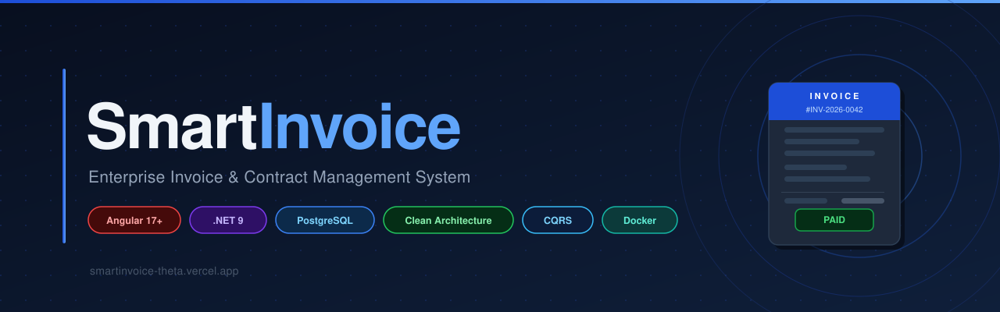
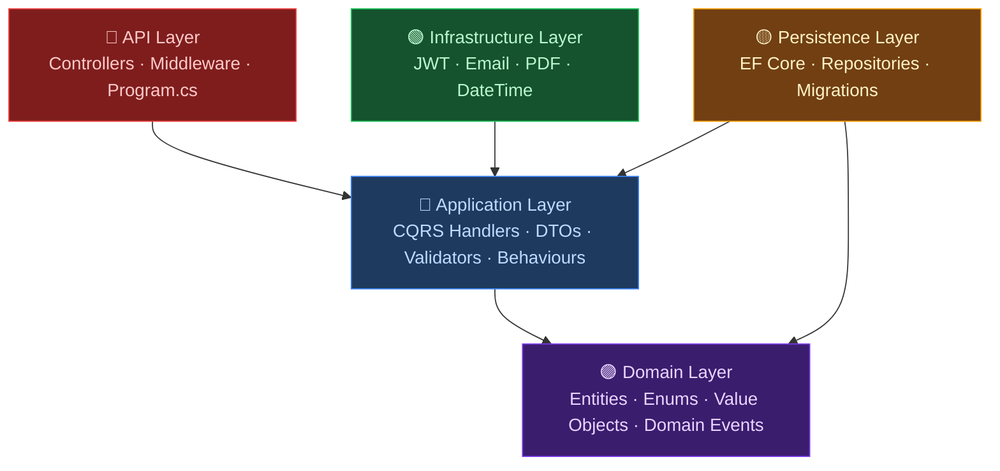
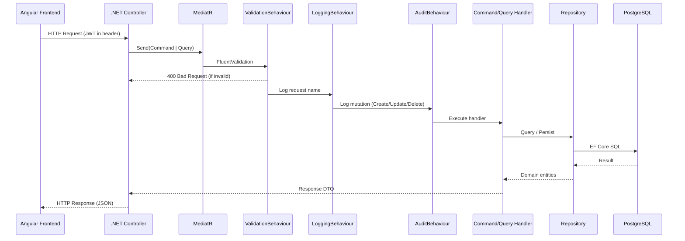
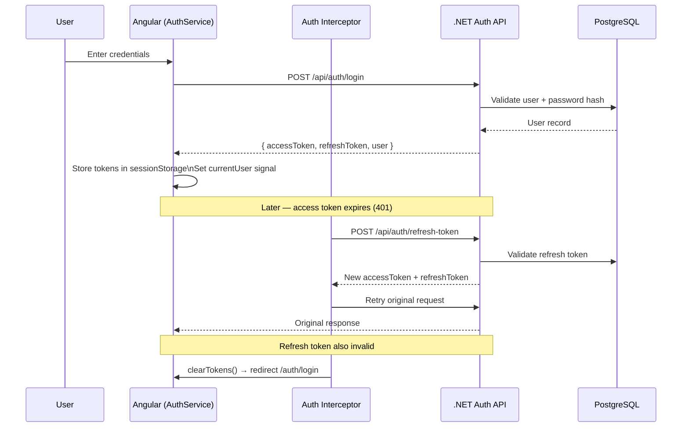
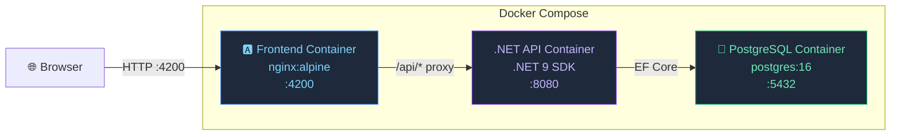
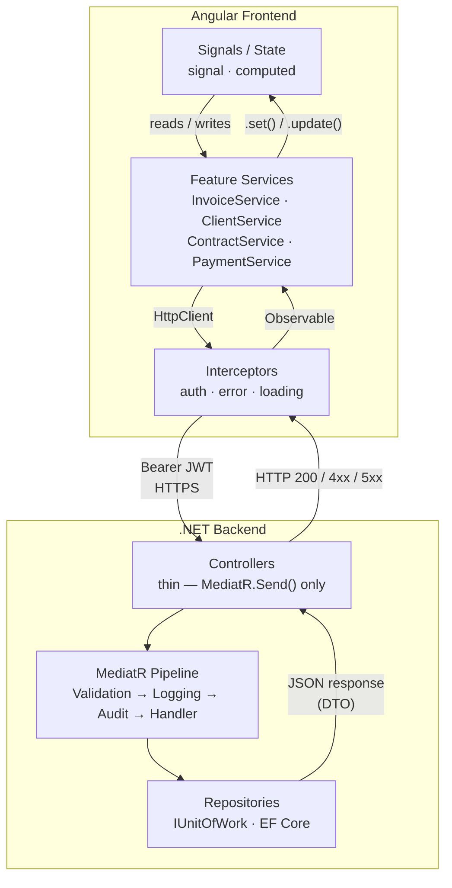

<div align="center">
  
  <br/><br/>
  <p>
    
    
    
    
    
    
  </p>
</div>

---

## � Live Demo

|                 | Link                                                                                            |
| --------------- | ----------------------------------------------------------------------------------------------- |
| **Frontend**    | [smartinvoice-theta.vercel.app](https://smartinvoice-theta.vercel.app)                          |
| **Backend API** | [smartinvoice-api.onrender.com](https://smartinvoice-api.onrender.com/health) |

> Demo credentials: `admin@smartinvoice.app` / `Admin@123`

---

## 🐳 Run Locally with Docker

```bash
git clone https://github.com/TshepoMahloko17/smartinvoice.git
cd smartinvoice
docker compose up --build
```

| Service       | URL                           |
| ------------- | ----------------------------- |
| Frontend      | http://localhost:4200         |
| API / Swagger | http://localhost:8080/swagger |
| Database      | localhost:5432                |

- Database is auto-created and seeded on first run
- Nginx inside the frontend container proxies `/api` calls to the backend — no CORS setup needed
- To stop: `docker compose down` (add `-v` to wipe the database)

---

## 🖼️ Screenshots: Dashboard, Invoices, Clients, Contracts, Payments


---

## 🔁 Animated Demos

Login flow, creating an invoice, downloading a PDF, and dashboard interactions:


<!-- 

 -->

## 📌 Overview

**SmartInvoice** is a production-grade, full-stack Invoice & Contract Management
System built for freelancers, agencies, and small-to-medium businesses.
It allows users to manage clients, create invoices, track payments,
handle contracts, and visualize financial performance — all in one place.

> Built as a portfolio project to demonstrate enterprise-level Angular + .NET
> Clean Architecture skills.

---

## ✨ Features

- 📊 **Financial Dashboard** — Real-time stats: Total Revenue, Pending Invoices,
  Active Clients, Paid This Month
- 📈 **Revenue Overview Chart** — Monthly trend with 3M / 6M / 1Y toggle
- 🧾 **Invoice Management** — Create, edit, filter, paginate, and download
  invoices as PDF
- 👥 **Client Management** — Full client profiles with invoice history
- 📋 **Contract Management** — Link contracts to clients and invoices
- 💳 **Payment Tracking** — Record and manage payments per invoice
- 🔐 **Authentication** — JWT-based login with refresh token support and
  silent token renewal
- 🖨️ **PDF Generation** — iTextSharp-powered invoice PDF export
- 🌗 **Theme Toggle** — Light / Dark mode support
- ⚠️ **Error Feedback** — Global HTTP error interceptor displays contextual
  snackbar messages for all API failures (400, 403, 404, 429, 5xx)
- ♿ **Accessibility** — All icon buttons carry descriptive `aria-label`
  attributes for screen reader compatibility

---

## 🛠️ Tech Stack

### Frontend

| Technology            | Purpose                                          |
| --------------------- | ------------------------------------------------ |
| Angular 17+           | SPA Framework                                    |
| TypeScript            | Language                                         |
| Angular Signals       | Reactive state management (`signal`, `computed`) |
| RxJS                  | HTTP streams                                     |
| Angular Material      | UI Component library                             |
| Chart.js / ApexCharts | Revenue charts                                   |
| SCSS                  | Styling                                          |

### Backend

| Technology            | Purpose                  |
| --------------------- | ------------------------ |
| .NET 9                | API Framework            |
| Clean Architecture    | Project structure        |
| CQRS + MediatR        | Command/Query separation |
| FluentValidation      | Input validation         |
| Entity Framework Core | ORM                      |
| PostgreSQL            | Database                 |
| JWT                   | Authentication           |
| SendGrid              | Email service            |
| iTextSharp            | PDF generation           |
| Swagger / OpenAPI     | API documentation        |
| Serilog               | Structured logging       |

### DevOps & CI/CD

| Technology     | Purpose                         |
| -------------- | ------------------------------- |
| Docker Compose | Local full-stack environment    |
| GitHub Actions | CI — build + test on every push |
| Render         | Backend hosting                 |
| Neon           | PostgreSQL database             |
| Vercel         | Frontend hosting                |
| Nginx          | Serve Angular + proxy `/api`    |

---

## 🔒 Security

| Feature                      | Implementation                                                                                           |
| ---------------------------- | -------------------------------------------------------------------------------------------------------- |
| **Rate Limiting**            | 10 req/min on `/api/auth/*` — returns 429 on breach (.NET 9 built-in)                                    |
| **Password Strength**        | FluentValidation: min 8 chars, uppercase, digit, special character                                       |
| **Security Headers**         | `X-Frame-Options`, `X-Content-Type-Options`, `X-XSS-Protection`, `Referrer-Policy`, `Permissions-Policy` |
| **Content Security Policy**  | `frame-ancestors 'none'` via Nginx (production)                                                          |
| **JWT Key Strength Check**   | Startup throws if key is < 32 chars or default dev value (production only)                               |
| **HTTPS Enforcement**        | Railway terminates TLS; HTTPS redirect in production                                                     |
| **Structured Audit Logging** | Serilog logs request pipeline; logging behaviour never serialises request bodies                         |
| **Error Snackbar**           | Global HTTP error interceptor shows user-friendly messages for all 4xx/5xx responses                     |
| **Token Storage**            | JWT tokens stored in `sessionStorage` — cleared automatically on tab/window close                        |

---

## 🏗️ High-Level Architecture

```
SmartInvoiceSystem/
│
├── backend/
│   ├── SmartInvoice.API            ← Entry point, Controllers, Middleware
│   ├── SmartInvoice.Application    ← CQRS, Use Cases, DTOs, Validators
│   ├── SmartInvoice.Domain         ← Entities, Enums, Value Objects, Events
│   ├── SmartInvoice.Infrastructure ← Email, PDF, JWT services
│   └── SmartInvoice.Persistence    ← EF Core, Repositories, Migrations
│
├── frontend/
│   └── smart-invoice-ui/           ← Angular application
│
└── docs/                           ← Architecture diagrams, API docs
```

---

## �️ Architecture Diagrams

### Clean Architecture — Layer Overview



> **Dependency Rule**: arrows point inward only — Domain has zero dependencies on any other layer.

---

### CQRS Request Flow



---

### Authentication Flow



---

### Docker / Container Architecture



> Nginx inside the frontend container rewrites `/api/*` → `http://backend:8080/api/*` — no CORS headers needed in production.

---

### Frontend ↔ Backend Communication



---

## �🔷 Backend Structure (.NET Clean Architecture)

### 🟣 Domain Layer — Pure Business Logic

```
SmartInvoice.Domain/
├── Entities/
│   ├── User.cs
│   ├── Client.cs
│   ├── Invoice.cs          ← Aggregate Root
│   ├── InvoiceItem.cs
│   ├── Contract.cs
│   └── Payment.cs
├── Enums/
│   ├── InvoiceStatus.cs    ← Paid | Pending | Overdue
│   └── Currency.cs         ← ZAR | USD | EUR
├── ValueObjects/
│   ├── Money.cs
│   └── Address.cs
├── Interfaces/
│   ├── IRepository.cs
│   └── IUnitOfWork.cs
└── DomainEvents/
    ├── InvoiceCreatedEvent.cs
    ├── InvoicePaidEvent.cs
    └── InvoiceOverdueEvent.cs
```

> ❌ No EF Core | ❌ No external libraries | ✅ Pure business logic only

---

### 🔵 Application Layer — Use Cases / CQRS

```
SmartInvoice.Application/
├── Features/
│   ├── Auth/Commands/
│   │   ├── Login/
│   │   └── RefreshToken/
│   ├── Dashboard/Queries/
│   │   ├── GetDashboardStats/
│   │   └── GetRevenueChart/
│   ├── Invoices/
│   │   ├── Commands/
│   │   │   ├── CreateInvoice/
│   │   │   ├── UpdateInvoice/
│   │   │   ├── DeleteInvoice/
│   │   │   └── UpdateInvoiceStatus/
│   │   └── Queries/
│   │       ├── GetInvoices/
│   │       ├── GetInvoiceById/
│   │       └── DownloadInvoicePdf/
│   ├── Clients/
│   │   ├── Commands/ (Create | Update | Delete)
│   │   └── Queries/ (GetAll | GetById | GetClientInvoices)
│   ├── Contracts/
│   │   ├── Commands/ (Create | Update | Delete | LinkToInvoice)
│   │   └── Queries/ (GetAll | GetById)
│   └── Payments/
│       ├── Commands/ (Record | Update | Delete)
│       └── Queries/ (GetAll | GetById)
├── DTOs/
├── Behaviours/
│   ├── ValidationBehaviour.cs
│   └── LoggingBehaviour.cs
├── Interfaces/
│   ├── IEmailService.cs
│   ├── IPdfService.cs
│   ├── ICurrentUserService.cs
│   └── IDateTimeService.cs
└── DependencyInjection.cs
```

---

### 🟢 Infrastructure Layer — External Services

```
SmartInvoice.Infrastructure/
├── Services/
│   ├── Email/SendGridEmailService.cs
│   ├── Pdf/PdfService.cs
│   └── DateTimeService.cs
├── Identity/
│   └── JwtService.cs
└── DependencyInjection.cs
```

---

### 🟡 Persistence Layer — Database

```
SmartInvoice.Persistence/
├── Context/AppDbContext.cs
├── Configurations/
│   ├── UserConfiguration.cs
│   ├── ClientConfiguration.cs
│   ├── InvoiceConfiguration.cs
│   ├── InvoiceItemConfiguration.cs
│   ├── ContractConfiguration.cs
│   └── PaymentConfiguration.cs
├── Repositories/
│   ├── InvoiceRepository.cs
│   ├── ClientRepository.cs
│   ├── ContractRepository.cs
│   └── PaymentRepository.cs
├── Migrations/
└── DependencyInjection.cs
```

---

### 🔴 API Layer — Entry Point

```
SmartInvoice.API/
├── Controllers/
│   ├── AuthController.cs
│   ├── DashboardController.cs
│   ├── InvoicesController.cs
│   ├── ClientsController.cs
│   ├── ContractsController.cs
│   └── PaymentsController.cs
├── Middleware/
│   ├── ExceptionMiddleware.cs
│   ├── RequestLoggingMiddleware.cs
│   └── SecurityHeadersMiddleware.cs
├── Extensions/ServiceExtensions.cs
└── Program.cs
```

> ✅ Controllers are thin — call MediatR, return responses, zero business logic

---

## 🔌 API Endpoints

### 🔐 Auth

| Method | Endpoint                    | Description       |
| ------ | --------------------------- | ----------------- |
| `POST` | `/api/auth/register`        | Register          |
| `POST` | `/api/auth/login`           | Login             |
| `POST` | `/api/auth/logout`          | Logout            |
| `POST` | `/api/auth/refresh-token`   | Refresh JWT token |
| `POST` | `/api/auth/forgot-password` | Forgot password   |

### 📊 Dashboard

| Method | Endpoint                                | Description               |
| ------ | --------------------------------------- | ------------------------- |
| `GET`  | `/api/dashboard/stats`                  | Get 4 stat card values    |
| `GET`  | `/api/dashboard/revenue-chart?range=6M` | Get chart data (3M/6M/1Y) |

### 🧾 Invoices

| Method   | Endpoint                          | Description                          |
| -------- | --------------------------------- | ------------------------------------ |
| `GET`    | `/api/invoices`                   | Get all invoices (paged + filtered)  |
| `GET`    | `/api/invoices/{id}`              | Get invoice by ID                    |
| `POST`   | `/api/invoices`                   | Create invoice                       |
| `PUT`    | `/api/invoices/{id}`              | Update invoice                       |
| `DELETE` | `/api/invoices/{id}`              | Delete invoice                       |
| `PATCH`  | `/api/invoices/{id}/status`       | Update status (Paid/Pending/Overdue) |
| `GET`    | `/api/invoices/{id}/download-pdf` | Download invoice as PDF              |

### 👥 Clients

| Method   | Endpoint                     | Description                   |
| -------- | ---------------------------- | ----------------------------- |
| `GET`    | `/api/clients`               | Get all clients (paged)       |
| `GET`    | `/api/clients/{id}`          | Get client by ID              |
| `GET`    | `/api/clients/{id}/invoices` | Get all invoices for a client |
| `POST`   | `/api/clients`               | Create client                 |
| `PUT`    | `/api/clients/{id}`          | Update client                 |
| `DELETE` | `/api/clients/{id}`          | Delete client                 |

### 📋 Contracts

| Method   | Endpoint                                       | Description               |
| -------- | ---------------------------------------------- | ------------------------- |
| `GET`    | `/api/contracts`                               | Get all contracts (paged) |
| `GET`    | `/api/contracts/{id}`                          | Get contract by ID        |
| `POST`   | `/api/contracts`                               | Create contract           |
| `PUT`    | `/api/contracts/{id}`                          | Update contract           |
| `DELETE` | `/api/contracts/{id}`                          | Delete contract           |
| `PATCH`  | `/api/contracts/{id}/link-invoice/{invoiceId}` | Link contract to invoice  |

### 💳 Payments

| Method   | Endpoint             | Description              |
| -------- | -------------------- | ------------------------ |
| `GET`    | `/api/payments`      | Get all payments (paged) |
| `GET`    | `/api/payments/{id}` | Get payment by ID        |
| `POST`   | `/api/payments`      | Record a payment         |
| `PUT`    | `/api/payments/{id}` | Update payment           |
| `DELETE` | `/api/payments/{id}` | Delete payment           |

---

## 🅰️ Frontend Structure (Angular)

```
smart-invoice-ui/src/app/
│
├── core/                        ← Singleton services, guards, interceptors
│   ├── interceptors/
│   │   ├── auth.interceptor.ts
│   │   ├── error.interceptor.ts
│   │   └── loading.interceptor.ts
│   ├── guards/
│   │   ├── auth.guard.ts
│   │   └── role.guard.ts
│   └── services/
│       ├── auth.service.ts
│       ├── storage.service.ts
│       └── current-user.service.ts
│
├── shared/                      ← Reusable components, pipes, models
│   ├── components/
│   │   ├── stat-card/
│   │   ├── status-badge/
│   │   ├── data-table/
│   │   ├── pagination/
│   │   ├── confirm-dialog/
│   │   └── loading-spinner/
│   ├── pipes/
│   │   ├── currency-format.pipe.ts
│   │   ├── date-format.pipe.ts
│   │   └── truncate.pipe.ts
│   ├── models/
│   │   ├── invoice.model.ts
│   │   ├── client.model.ts
│   │   ├── contract.model.ts
│   │   ├── payment.model.ts
│   │   ├── user.model.ts
│   │   ├── dashboard-stats.model.ts
│   │   └── api-response.model.ts
│   └── enums/
│       ├── invoice-status.enum.ts
│       └── currency.enum.ts
│
├── layout/                      ← App shell
│   ├── sidebar/
│   ├── navbar/
│   └── main-layout/
│
└── features/
    ├── auth/
    │   └── pages/ (login | forgot-password)
    ├── dashboard/
    │   ├── pages/dashboard/
    │   └── components/
    │       ├── stats-overview/     ← 4 stat cards
    │       └── revenue-chart/      ← Line chart (3M|6M|1Y)
    ├── invoices/
    │   ├── pages/ (list | detail | form)
    │   └── components/
    │       ├── invoice-table/
    │       ├── invoice-filter/
    │       └── invoice-items-table/
    ├── clients/
    │   └── pages/ (list | detail | form)
    ├── contracts/
    │   └── pages/ (list | detail | form)
    └── payments/
        └── pages/ (list | form)
```

---

## 🧠 Key Design Decisions

### Invoice as Aggregate Root

```csharp
public class Invoice
{
    public void AddItem(InvoiceItem item) { ... }
    public void CalculateTotal() { ... }
    public void MarkAsPaid() { ... }      // Logic lives in Domain
    public void MarkAsOverdue() { ... }
}
```

### Entity Relationships

```
User ──────► Clients
               │
               ▼
           Invoices ◄──── Contracts
               │
               ▼
         InvoiceItems
               │
               ▼
           Payments
```

### CQRS Flow

```
Angular → HTTP Request
  → .NET Controller (thin)
    → MediatR.Send(Command/Query)
      → Handler (Application layer)
        → Repository (Persistence layer)
          → Database (PostgreSQL)
```

---

## 🚀 Getting Started

### Prerequisites

- Node.js 20+
- .NET 9 SDK
- PostgreSQL 16 (or use Docker — see above)
- Angular CLI (`npm install -g @angular/cli`)

### Backend Setup

```bash
cd backend/SmartInvoice.API
dotnet restore
# Set connection string in appsettings.Development.json (or use DATABASE_URL env var)
dotnet ef database update
dotnet run
```

### Frontend Setup

```bash
cd frontend/smart-invoice-ui
npm install
ng serve
```

> API runs on: `http://localhost:8080`
> Angular runs on: `http://localhost:4200`

---

## 🧪 Testing

```bash
# Backend Tests (xUnit + Moq — 50 tests)
cd backend
dotnet test SmartInvoice.Tests

# Angular Tests (Jest — 8 suites)
cd frontend/smart-invoice-ui
npm test
```

---

## �‍💻 Author

**Tshepo Mahloko**

- Full Stack Developer with 7+ years of experience
- ASP.NET Core | Angular | React | PHP
- Currently: Angular Developer @ Standard Bank

---

## 📄 License

This project is licensed under the MIT License.
